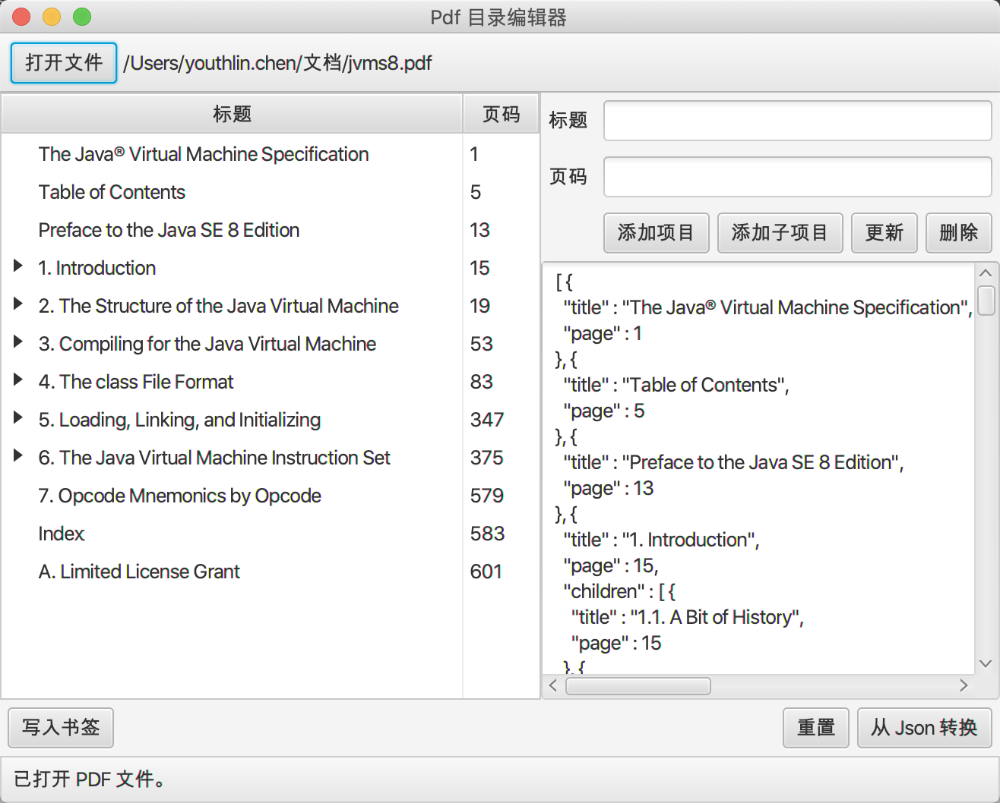
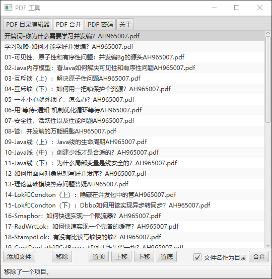
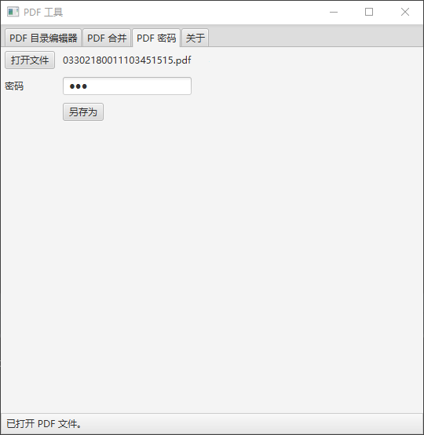
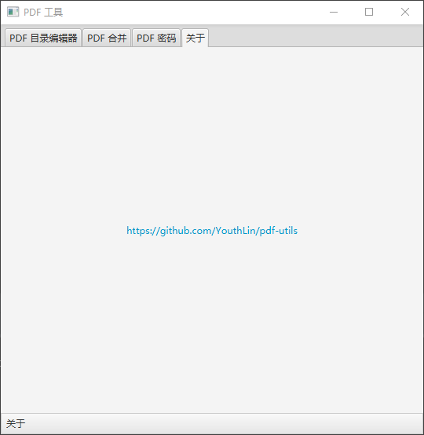

# PDF Util 
PDF 工具

---

PDF Bookmark Editor  
  
PDF 目录编辑器  

PDF Merger  
  
PDF 合并    

PDF Password  
  
PDF 密码  

About  
  
关于  

## i18n
https://youthlin.com/20161315.html  

Use PoEdit create a new translation from
[Message_zh_CN.po](src/main/resources/Message_zh_CN.po)
and you get .po file, then see [translatePoToClass.sh](/src/main/resources/translatePoToClass.sh)
